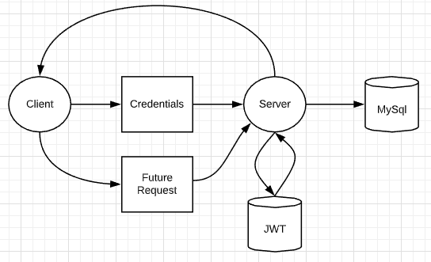

# Tarpaulin

Tarpaulin is a lightweight course management tool. This project practices the implementation of a RESTful API. Utilizing Node.js, express and mysql. While being completely dockerized for deployable enviornments. Tarpaulin consists of Users, Courses, Assignments and Submissions. Each represented as a resource. 

## API Architecture Diagram

The API is designed to be a REpresentational State Transfer (REST) API. Each endpoint is predefined with stateless operations. Minimizing the payload size sent through a HTTP request. A Restful approach was taken because
REST is the most efficient and widespread standard in the creation of APIs for internet services. 

The figure above represents a secure transaction architecture. Once a user provides
authenticated credentials in the login endpoint. The server grants the client a JWT token for
future requests. JWT tokens are used to authenticate future client requests. This reduces
eavesdroppers from receiving user information for transaction security

All error messages are saved into the database. This is for debugging the API and also
monitoring it’s activity. In every else or catch block that would otherwise send a res.status(4xx)
message. next() is instead called where it is routed to a use( catchall ) middleware function in
server.js. It stores the message to the server then dispatches the message to the client.

### API Data Layout 

Users store every user that creates an account. Any user can create a student account where
only admins can create other admins or instructors. Therefore the relationship between usersadmins, is a 1 to 1 relationship. The Instructors table not only stores an instructorId, but also the
classId they teach so their instructorId may appear more than once if they teach multiple
classes. Therefore the relationship is 1 to many. For enrolledStudents it is a similar design. Any
class they may be enrolled in is another entry in the table. Making the relationship between
users-enrolledStudents 1 to many.

Courses table stores course information. Only admins can create courses. Students who are
enrolled in the courses may use a inner join to find their relationship. CourseId is a foreign key
in instructors, enrolledStudents, and assignments tables. The assignments table stores
assignments created by instructors or admins. It is restricted to being created by the instructor of
the same class. Like users-enrolledStudents or users-instructors table relationships.
Assignments has a similar relationship with submissions. A one the many relationship. Classes
may have many students. An assignment for a course receives many assignment submissions.

The database consists of 4 main tables:
* users
* courses
* assignments
* submissions

Each user has a role which grants them different levels of data privlidge 
* admin
* instructor
* student

### Third Party Tools 

JQ is a great tool for bash that parses a curl request into json. This enabled creating test scripts
with dynamic values. Creating CSV files was simple with Json2CSV. A third party tool used to
parse json with dynamic headers into a CSV file.