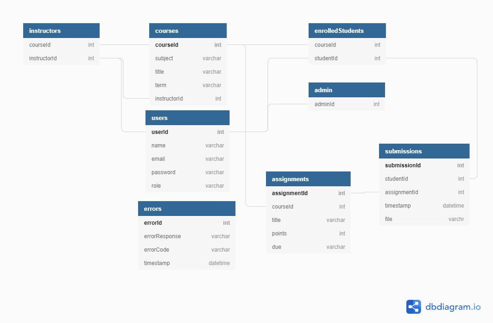

# Tarpaulin

Tarpaulin is a lightweight course management tool. This project practices the implementation of a RESTful API. Utilizing Node.js, express and mysql. While being completely dockerized for deployable enviornments. Tarpaulin consists of Users, Courses, Assignments and Submissions. Each represented as a resource. 

## API Architecture Diagram

The database consists of 4 main tables:
    * users
    * courses
    * assignments
    * submissions

Each user has access authorization at three levels
    * admin
    * instructor
    * student